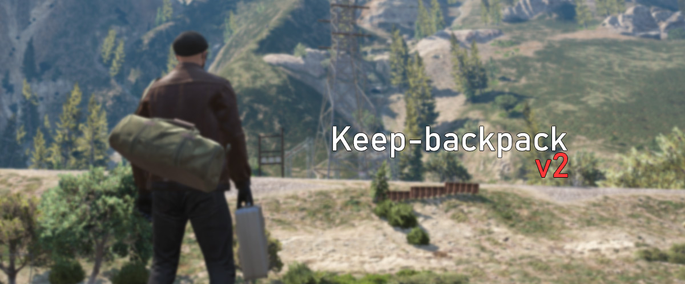

# keep-backpack



keep-backpack is a backpack script designed to enhance the inventory management experience for players. With a range of key features.

## Key Features

- **Expanded Inventory Capacity**: Players can carry more materials and items within their inventory, allowing for greater flexibility and resource management.

- **Backpack Props**: The script provides realistic visuals by displaying backpack props on the player's back or hands, indicating that they are equipped with a backpack.

- **Blacklisted Items**: A flexible option allows you to specify blacklisted items, ensuring that certain items cannot be stored in the backpack. This feature helps maintain balance and prevents abuse.

- **Smooth Animation**: Opening and closing animations provide an immersive and visually appealing experience when accessing the backpack. These animations enhance realism and immersion within the game.

- **Locking System**: Backpacks can be equipped with a locking system, offering an additional layer of security for valuable or sensitive items.

- **Prevents Exploits**: The script actively prevents the "backpack in backpack" exploit, ensuring fair gameplay and maintaining the integrity of the inventory system.

## ❤️ Support Development

If you enjoy my work and would like to show your appreciation, please consider making a donation to support the ongoing development of the script. Your contribution goes a long way in helping me add more exciting features and improvements. 🚀

- Click Here -> [ko-fi](https://ko-fi.com/swkeep)

Thank you for your generosity and support! 🙏

# Preview

Check out Keep-Backpack preview for a better understanding of the mod's functionality.
[Preview Youtube](https://youtu.be/7r6rUoMfvV4)

# Dependencies

- qb-core
- qb-inventory
- progressbar
- **[keep-harmony](https://swkeep.tebex.io/package/5592482)**

# How to Install

Follow the steps mentioned below to install keep-backpack:

# step 0:

- Add images inside `inventoryimages` to `qb-inventory/html/images`

# step 1:

- Add Below code to `qb-core/shared/items.lua`

```lua
["backpack1"] = {
     ["name"] = "backpack1",
     ["label"] = "Backpack",
     ["weight"] = 7500,
     ["type"] = "item",
     ["image"] = "backpack1.png",
     ["unique"] = true,
     ["useable"] = true,
     ["shouldClose"] = true,
     ["combinable"] = nil,
     ["description"] = "A stylish backpack"
},
["backpack2"] = {
     ["name"] = "backpack2",
     ["label"] = "Backpack",
     ["weight"] = 15000,
     ["type"] = "item",
     ["image"] = "backpack2.png",
     ["unique"] = true,
     ["useable"] = true,
     ["shouldClose"] = true,
     ["combinable"] = nil,
     ["description"] = "A stylish backpack"
},
["backpack3"] = {
     ["name"] = "backpack3",
     ["label"] = "Backpack",
     ["weight"] = 15000,
     ["type"] = "item",
     ["image"] = "backpack3.png",
     ["unique"] = true,
     ["useable"] = true,
     ["shouldClose"] = true,
     ["combinable"] = nil,
     ["description"] = "A stylish backpack"
},
["backpack4"] = {
     ["name"] = "backpack4",
     ["label"] = "Backpack",
     ["weight"] = 15000,
     ["type"] = "item",
     ["image"] = "backpack4.png",
     ["unique"] = true,
     ["useable"] = true,
     ["shouldClose"] = true,
     ["combinable"] = nil,
     ["description"] = "A stylish backpack"
},
["backpack5"] = {
     ["name"] = "backpack5",
     ["label"] = "Backpack",
     ["weight"] = 15000,
     ["type"] = "item",
     ["image"] = "backpack5.png",
     ["unique"] = true,
     ["useable"] = true,
     ["shouldClose"] = true,
     ["combinable"] = nil,
     ["description"] = "A stylish backpack"
},
["backpack6"] = {
     ["name"] = "backpack6",
     ["label"] = "Backpack",
     ["weight"] = 15000,
     ["type"] = "item",
     ["image"] = "backpack6.png",
     ["unique"] = true,
     ["useable"] = true,
     ["shouldClose"] = true,
     ["combinable"] = nil,
     ["description"] = "A stylish backpack"
},
["backpack7"] = {
     ["name"] = "backpack7",
     ["label"] = "Backpack",
     ["weight"] = 15000,
     ["type"] = "item",
     ["image"] = "backpack7.png",
     ["unique"] = true,
     ["useable"] = true,
     ["shouldClose"] = true,
     ["combinable"] = nil,
     ["description"] = "A stylish backpack"
},
["duffle1"] = {
     ["name"] = "duffle1",
     ["label"] = "Duffle bag",
     ["weight"] = 15000,
     ["type"] = "item",
     ["image"] = "duffle1.png",
     ["unique"] = true,
     ["useable"] = true,
     ["shouldClose"] = true,
     ["combinable"] = nil,
     ["description"] = "A stylish duffle bag"
},
["duffle2"] = {
     ["name"] = "duffle2",
     ["label"] = "Duffle bag",
     ["weight"] = 15000,
     ["type"] = "item",
     ["image"] = "duffle2.png",
     ["unique"] = true,
     ["useable"] = true,
     ["shouldClose"] = true,
     ["combinable"] = nil,
     ["description"] = "A stylish duffle bag"
},
["briefcase"] = {
     ["name"] = "briefcase",
     ["label"] = "Briefcase",
     ["weight"] = 10000,
     ["type"] = "item",
     ["image"] = "briefcase.png",
     ["unique"] = true,
     ["useable"] = true,
     ["shouldClose"] = true,
     ["combinable"] = nil,
     ["description"] = "A portable rectangular case used for carrying important documents, files, or other personal belongings."
},
["paramedicbag"] = {
     ["name"] = "paramedicbag",
     ["label"] = "Paramedic bag",
     ["weight"] = 5000,
     ["type"] = "item",
     ["image"] = "paramedicbag.png",
     ["unique"] = true,
     ["useable"] = true,
     ["shouldClose"] = true,
     ["combinable"] = nil,
     ["description"] = "A medical bag used by paramedics, containing essential supplies for emergency care."
},

-- new item
["briefcaselockpicker"] = {
     ["name"] = "briefcaselockpicker",
     ["label"] = "Briefcase Lockpicker",
     ["weight"] = 500,
     ["type"] = "item",
     ["image"] = "lockpick.png",
     ["unique"] = false,
     ["useable"] = true,
     ["shouldClose"] = true,
     ["combinable"] = nil,
     ["description"] = "Briefcase Lockpicker"
},
```

## ESX (ox_inventory)

```lua
["backpack1"] = {
     label = "backpack1",
     weight = 15,
     stack = false,
     close = true,
     description = "A stylish backpack"
},
["backpack2"] = {
     label = "backpack2",
     weight = 15,
     stack = false,
     close = true,
     description = "A stylish backpack"
},
["backpack3"] = {
     label = "backpack3",
     weight = 15,
     stack = false,
     close = true,
     description = "A stylish backpack"
},
["backpack4"] = {
     label = "backpack4",
     weight = 15,
     stack = false,
     close = true,
     description = "A stylish backpack"
},
["backpack5"] = {
     label = "backpack5",
     weight = 15,
     stack = false,
     close = true,
     description = "A stylish backpack"
},
["backpack6"] = {
     label = "backpack6",
     weight = 15,
     stack = false,
     close = true,
     description = "A stylish backpack"
},
["backpack7"] = {
     label = "backpack7",
     weight = 15,
     stack = false,
     close = true,
     description = "A stylish backpack"
},
["duffle1"] = {
     label = "Duffle bag",
     weight = 15,
     stack = false,
     close = true,
     description = "A stylish duffle bag"
},
["duffle2"] = {
     label = "Duffle bag",
     weight = 15,
     stack = false,
     close = true,
     description = "A stylish duffle bag"
},
["briefcase"] = {
     label = "Briefcase",
     weight = 10,
     stack = false,
     close = true,
     description = "A portable rectangular case used for carrying important documents, files, or other personal belongings."
},
["paramedicbag"] = {
     label = "Paramedic bag",
     weight = 5,
     stack = false,
     close = true,
     description = "A medical bag used by paramedics, containing essential supplies for emergency care."
},

["briefcaselockpicker"] = {
     label = "Briefcase Lockpicker",
     weight = 0.5,
     stack = true,
     close = true,
     description = "Briefcase Lockpicker"
}
```

# Step 2: Fix for Exploits

The following steps will guide you on how to fix a specific exploit related to backpacks within backpacks.

1. Open `qb-inventory/server/main.lua` file.
2. Scroll down and locate the event `inventory:server:SaveInventory`.
3. Add the following line of code at the top of this event:

```lua
local src = source
```

This will define a local variable `src` and set its value to the `source` argument passed into the event.

4. Find the `elseif type == "stash" then` statement - it should look like this:

```lua
elseif type == "stash" then
    SaveStashItems(id, Stashes[id].items)
elseif type == "drop" then
```

5. Replace this code block with the following updated version:

```lua
elseif type == "stash" then
    local indexstart, indexend = string.find(id, 'Backpack_')
    if indexstart and indexend then
        TriggerEvent('keep-backpack:server:saveBackpack', source, id, Stashes[id].items)
        Stashes[id].isOpen = true
        return
    end
    SaveStashItems(id, Stashes[id].items)
elseif type == "drop" then
```

This new code block checks to see if the `id` variable contains "Backpack\_" within it. If it does, it triggers the `keep-backpack:server:saveBackpack` event which is responsible for saving backpacks within backpacks. Otherwise, it saves the stash items as usual.

- done

# Support

- [Discord](https://discord.gg/ccMArCwrPV)
